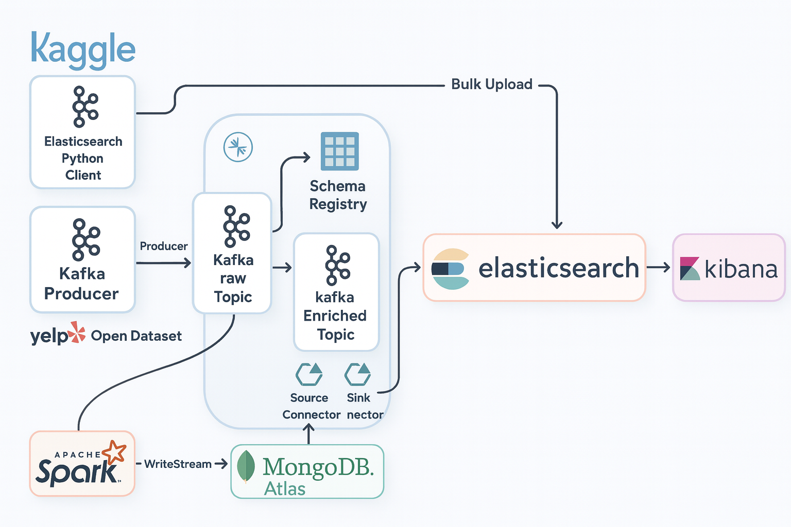

# Real-Time Data Pipeline (Kafka, Spark, MongoDB, Elasticsearch, Kibana)

A real-time data engineering pipeline built using Apache Kafka, Spark Structured Streaming, MongoDB Atlas, Elasticsearch, and Kibana.  
The system ingests data from the Yelp Open Dataset (Kaggle), processes it through Kafka and Spark, stores enriched data in MongoDB, and indexes it into Elasticsearch for visualization in Kibana.

---

## Architecture

---

## Pipeline Overview

The pipeline processes Yelp dataset records through multiple stages:

- Ingestion of raw data using a Kafka Producer
- Streaming into a Kafka Raw Topic
- Schema validation using Schema Registry
- Enrichment via Spark Structured Streaming
- Storage of enriched data in MongoDB Atlas
- MongoDB → Kafka replication via Source Connector
- Kafka Enriched Topic → Elasticsearch indexing via Sink Connector
- Visualization using Kibana

---

## Components

### Kafka Producer
Sends raw Yelp dataset records into the **Kafka Raw Topic**.

### Kafka Raw Topic
Stores unprocessed messages for downstream consumers.

### Schema Registry
Maintains Avro/JSON schemas for validation and compatibility.

### Spark Structured Streaming
Consumes raw Kafka data, applies transformations, and writes enriched output to MongoDB Atlas.

### MongoDB Atlas
Stores enriched records for operational and analytical access.

### Kafka Connect
- **Source Connector:** Streams MongoDB documents to Kafka Enriched Topic  
- **Sink Connector:** Sends enriched Kafka data to Elasticsearch

### Kafka Enriched Topic
Contains fully processed and validated messages.

### Elasticsearch
Indexes enriched documents for search and analytics.

### Kibana
Provides dashboards and insights using Elasticsearch indices.

---

## Data Flow

1. Kaggle/Yelp dataset → Kafka Producer  
2. Kafka Producer → Kafka Raw Topic  
3. Raw Topic → Schema Registry  
4. Raw Topic → Spark Structured Streaming  
5. Spark → MongoDB Atlas  
6. MongoDB → Kafka Enriched Topic (Source Connector)  
7. Enriched Topic → Elasticsearch (Sink Connector)  
8. Elasticsearch → Kibana  

---

## Tech Stack

- Apache Kafka  
- Kafka Connect  
- Schema Registry  
- Apache Spark Structured Streaming  
- MongoDB Atlas  
- Elasticsearch  
- Kibana  
- Python (Producer, Elasticsearch client)

---

---

## Running the Pipeline (High-Level)

1. Start Kafka, Zookeeper, Schema Registry, and Kafka Connect  
2. Run the Kafka Producer to publish raw dataset  
3. Start the Spark Streaming job  
4. Configure MongoDB Atlas and connectors  
5. Start the sink connector for Elasticsearch  
6. Open Kibana and visualize indexed data  

